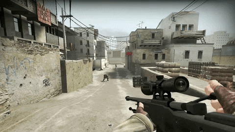

<h1 align="center">Research on Different Methods of Game Design</h1>

----

## 1. PROCEDURAL GENERATION
Procedural generation in game design refers to the automatic creation of content within a game using algorithms and predefined rules. Instead of manually designing and creating every aspect of a game, procedural generation allows developers to generate a vast amount of content dynamically, providing unique experiences for players.

Procedural generation can be applied to various game elements, including landscapes, levels, characters, quests, items, and more. It involves defining a set of rules, algorithms, and parameters that govern how the content is generated. These rules can range from simple to complex, depending on the desired outcome.

#####The process of procedural generation typically involves the following steps:

1. **Seed Generation:**
A random seed value is generated, which serves as the initial input for the procedural generation algorithm. The same seed will always produce the same result, allowing for consistent generation of content.

2. **Generation Algorithm:** 
Developers design algorithms that define the rules and processes for generating content. These algorithms can be based on various techniques, such as fractals, cellular automata, noise functions, grammars, and more. The algorithm takes the seed as input and applies the rules to generate content accordingly.

3. **Parameterization:** 
Parameters are used to control and fine-tune the generation process. These parameters can include variables such as size, complexity, density, randomness, and other factors that affect the generated content. Adjusting these parameters can lead to different outcomes and variations in the generated content.

4. **Content Generation:** 
The generation algorithm uses the seed and parameters to create the desired content. This can involve creating terrain, populating a level with objects and enemies, designing quests with objectives and rewards, generating characters with unique attributes, or any other aspect of the game.

5. **Validation and Iteration:**
After content is generated, it undergoes validation to ensure it meets certain criteria or constraints defined by the game designer. If the content doesn't meet the criteria, the algorithm is adjusted or iterated to improve the results. This iterative process helps refine the procedural generation until the desired content quality is achieved.

#####Benefits of Procedural Generation in Game Design:

1. **Vast Content Possibilities:**
 Procedural generation allows for the creation of vast amounts of content without the need for manual creation. This can result in a virtually infinite game world with unique experiences for players.

2. **Efficiency:** 
Generating content procedurally can be more efficient than manually designing and creating every asset. Once the algorithms and rules are defined, the game can generate content quickly and on-demand.

3. **Replayability:**
Procedurally generated games often offer high replayability as each playthrough can provide a different experience. The randomness and variability in the generated content keep the game fresh and engaging for players.

4. **Scalability:** 
Procedural generation allows developers to create large and complex game worlds without a significant increase in development time. The algorithms can be designed to scale to different sizes and levels of detail.

5. **Adaptability:** Procedural generation enables dynamic adaptation to player actions and preferences. The generated content can respond to player choices, ensuring a personalized experience.

#####Game genres that highly utilize Procedural Generation

Procedural generation is used in various game genres to create dynamic and ever-changing gameplay experiences. Some of the genres that heavily utilize procedural generation include:

1.  **Roguelikes and Roguelites:** 
Roguelike games are characterized by their procedurally generated levels, permadeath mechanics, and high difficulty. Each playthrough offers a new set of challenges and levels, ensuring high replayability. Examples include "Rogue Legacy," "The Binding of Isaac," and "Spelunky."

2. **Open-World Sandbox:** 
Procedural generation is commonly employed in open-world sandbox games to create vast and diverse landscapes, including terrains, vegetation, and bodies of water. This approach allows for exploration and discovery of new locations. "Minecraft" is a prominent example of an open-world sandbox game that extensively uses procedural generation.

3. **Survival and Crafting:** 
Survival games often employ procedural generation to create environments, resources, and crafting materials. This ensures that each playthrough presents different challenges and resource distributions. Games like "Don't Starve," "Terraria," and "Subnautica" utilize procedural generation to provide players with unique survival experiences.

4. **Procedural Platformers:** 
Platforming games that utilize procedural generation create randomized levels, platforms, and obstacles. This leads to fresh and unpredictable challenges for players. Titles like "Spelunky," "Celeste," and "Super Meat Boy" implement procedural generation to enhance replayability.

5. **Strategy and Simulation:**
 Procedural generation is frequently used in strategy and simulation games to generate maps, terrain features, and resources. This approach allows for a dynamic and diverse world, ensuring that each playthrough offers unique strategic opportunities. Games such as "Civilization," "RimWorld," and "Dwarf Fortress" use procedural generation to create expansive and immersive game worlds.

6. **Space Exploration:**
 Space exploration games often utilize procedural generation to generate galaxies, star systems, planets, and celestial bodies. This enables players to explore an expansive universe with a virtually infinite number of unique locations. Titles like "No Man's Sky," "Elite Dangerous," and "Kerbal Space Program" leverage procedural generation to create vast and realistic space environments.

##Games Implementing Procedural Generation
###1. FTL:Faster Than Light

**Genre = roguelike/lite and space exploration strategy** 

In "FTL: Faster Than Light," players take control of a spaceship and navigate through a procedurally generated galaxy, facing various encounters and challenges along the way. The game utilizes procedural generation in multiple aspects:

1. **Galaxy Map:**
 The game generates a unique galaxy map for each playthrough, with different sectors, star systems, and nodes. The placement and connections of these nodes are randomized, ensuring that each playthrough offers a different layout and exploration experience.

2. **Encounters:** 
As players traverse the galaxy, they encounter different events, such as enemy ships, friendly encounters, distress signals, and more. The encounters are procedurally generated, providing a wide range of scenarios and outcomes. Each encounter presents choices and consequences, shaping the player's journey.

3. **Ship Layouts:** 
"FTL" features various playable ships, each with its own layout and equipment. The ship layouts are procedurally generated, offering different room configurations and systems. This adds variety and strategic considerations to gameplay, as players must adapt their tactics based on the ship they are commanding.

4. **Enemy Ships:** 
When engaging in combat, players encounter procedurally generated enemy ships. These ships have different layouts, weapons, and crew members, creating unique challenges in each battle. The randomness of enemy ship generation keeps the combat encounters fresh and unpredictable.

5. **Rewards and Upgrades:**
 Throughout the game, players can acquire resources, weapons, and ship upgrades as rewards from encounters or events. The availability and type of rewards are procedurally generated, ensuring that each playthrough presents different opportunities for ship improvement and customization.

By incorporating procedural generation, "FTL: Faster Than Light" provides a high level of replayability. Each playthrough offers a unique combination of galaxy layout, encounters, and ship configurations, creating varied and unpredictable gameplay experiences within the roguelike/lite and space exploration strategy genres.

###2. No Man's Sky

**Genre = open-world exploration and survival** 

In "No Man's Sky," players explore a vast, procedurally generated universe with billions of planets, each having its own unique ecosystem, flora, fauna, and resources. The game utilizes procedural generation in several key aspects:

1. **Planetary Generation:**
 The game's universe is generated procedurally, creating a virtually infinite number of planets to explore. Each planet has its own terrain, climate, atmosphere, and geological features. The generation algorithm creates diverse landscapes, including mountains, caves, oceans, and deserts, with unique combinations of flora and fauna.

2. **Creature Generation:**
 The game's algorithm procedurally generates a wide variety of creatures that inhabit the planets. These creatures can have different sizes, shapes, colors, behaviors, and characteristics. The procedural generation ensures a seemingly endless array of alien life forms to encounter and study.

3.  **Resource Placement:**
 Resources such as minerals, plants, and elements are distributed procedurally across the planets. The generation algorithm determines the locations, types, and abundance of resources, creating a dynamic and unpredictable resource economy. This drives the player's exploration and resource gathering efforts.

4. **Space Exploration:** 
The procedural generation extends to the space aspect of the game as well. Star systems, space stations, asteroids, and other celestial bodies are procedurally generated. Each star system has its own set of planets, space stations, and trading opportunities, providing a sense of exploration and discovery as players navigate the vastness of space.

5. **Procedural Quests:**
 In addition to the exploration and survival elements, "No Man's Sky" features procedural generation in its quests and missions. The game generates a variety of missions with different objectives, rewards, and narratives, offering players a range of activities and goals to pursue.

Through the use of procedural generation, "No Man's Sky" creates an expansive and immersive open-world experience. The procedural generation algorithms ensure that every player's journey through the game's universe is unique, filled with diverse planets, creatures, resources, and quests, making it a standout example within the open-world exploration and survival genre.

###3. Spelunky

**Genre = platformer and roguelike** 

In "Spelunky," players navigate through a series of randomly generated underground levels filled with traps, enemies, treasures, and secrets. The game extensively uses procedural generation to create its gameplay elements:

1. **Level Generation:** 
Each time a player starts a new run, the game procedurally generates a unique set of levels. The layout of platforms, tunnels, and rooms is randomized, ensuring that no two playthroughs are the same. This procedural level generation adds a sense of exploration and discovery as players venture into unknown depths.

2. **Enemy Placement:** 
"Spelunky" features a variety of enemies that populate the levels. The game procedurally places enemies in different positions and configurations, creating unpredictable enemy encounters and requiring players to adapt their strategies on the fly.

3. **Trap and Hazard Generation:** 
The game employs procedural generation to position traps, hazards, and environmental obstacles throughout the levels. Spikes, arrow traps, boulders, and other deadly obstacles are scattered randomly, making each playthrough a unique challenge.

4. **Item and Treasure Placement:** 
"Spelunky" includes a wide range of items, power-ups, and treasures. These items are procedurally placed throughout the levels, allowing players to discover and collect them as they progress. The randomness in item placement adds excitement and strategic decision-making to the gameplay.

5. **Secrets and Level Variants:** 
The game incorporates hidden areas, shortcuts, and secret passages that are procedurally generated. These hidden elements encourage exploration and reward players who thoroughly explore the levels. Additionally, the game features level variants, such as jungle, ice caves, and temple themes, which are randomly selected for each playthrough, adding visual diversity and unique challenges.

The combination of procedural level generation, enemy placement, trap and hazard layout, item distribution, and secret placement in "Spelunky" creates a highly replayable experience within the platformer and roguelike genres. Players must adapt to the ever-changing environments, enemies, and challenges, making each run a thrilling and unpredictable adventure.

###4. Diablo III

**Genre = action role-playing games (ARPG)** 
In "Diablo III," players embark on an epic quest to defeat the forces of evil in a dark and dynamic fantasy world. The game incorporates procedural generation in various aspects:

1. **Dungeon Generation:** 
The game generates random dungeons, caves, and other areas for players to explore. Each time players venture into a new area or start a new quest, the layout of the environment is procedurally generated. This ensures that players encounter different layouts, room configurations, and enemy placements, enhancing the replayability of the game.

2. **Item Generation:** 
"Diablo III" features an extensive loot system with a vast array of weapons, armor, and magical items. These items are procedurally generated with varying attributes, stats, and affixes. This randomization adds excitement and the potential for finding powerful and unique equipment during gameplay.

3. **Monster Placement:**
 The game procedurally places different types of monsters and enemies throughout the world. The distribution, types, and strengths of the enemies vary, offering diverse combat encounters and challenges. This dynamic enemy placement keeps the gameplay engaging and unpredictable.

4. **Event Generation:**
 Random events and encounters occur during players' journeys, providing additional quests, challenges, or opportunities for rewards. These events are procedurally generated, presenting players with unexpected situations and adding depth to the game's narrative and exploration.

5. **Level Scaling:** 
"Diablo III" incorporates procedural generation to scale the difficulty of the game. As players progress and increase in power, the game adjusts the strength and numbers of enemies encountered. This ensures a challenging experience and prevents repetitive gameplay by dynamically adapting to the player's progression.

The use of procedural generation in "Diablo III" enhances the replayability and longevity of the game within the action role-playing genre. Each playthrough offers a unique combination of dungeon layouts, item drops, enemy encounters, and events, providing players with a continually fresh and engaging experience as they explore the dark fantasy world of Sanctuary.

###5. Minecraft

**Genre = sandbox and survival** 

In Minecraft, the entire game world, known as the "Overworld," is procedurally generated. The procedural generation in Minecraft occurs in several key aspects:

1. **Terrain Generation:**
 The terrain of the Minecraft world is procedurally generated, creating a diverse landscape of mountains, hills, plains, forests, oceans, and more. The generation algorithm uses a combination of fractals, noise functions, and other techniques to create the terrain with different elevations, biomes, and features.

2. **Cave Systems:**
 Beneath the surface, Minecraft generates complex cave systems. These caves consist of interconnected tunnels, chambers, and underground lakes, providing opportunities for exploration and mining resources. The procedural generation creates a seemingly endless network of caves, each with its own unique layout and characteristics.

3. **Structures and Biomes:**
 Minecraft procedurally generates various structures, such as villages, temples, dungeons, mineshafts, and strongholds, across the world. These structures appear in different biomes, which are distinct ecological zones with specific vegetation, weather patterns, and mob spawns. The placement of structures and biomes is randomized, ensuring a varied and ever-changing world.

4. **Resource Distribution:**
 Resources, such as minerals, ores, and trees, are procedurally distributed throughout the Minecraft world. The generation algorithm determines the density, frequency, and arrangement of resources, making each location unique and requiring players to explore and mine in different areas to acquire the materials they need.

5. **World Size and Boundaries:**
 Minecraft worlds are virtually infinite in size, with procedurally generated terrain extending beyond what players can explore. As players move towards the edges of the explored areas, new chunks of the world are generated on-the-fly, seamlessly expanding the playable space.

The procedural generation in Minecraft allows for an immense amount of exploration, creativity, and player-driven experiences. The sandbox nature of the game, coupled with the procedurally generated world, enables players to shape and interact with their surroundings, building structures, crafting tools, and embarking on various adventures within the expansive and dynamic Minecraft universe.
___

## 2. PHYSICS BASED GAMES

Physics-based games are a genre of video games that simulate realistic physics principles to create interactive and immersive gameplay experiences. These games utilize physics engines, which are software libraries that calculate and simulate the physical interactions between objects in a virtual environment.

The fundamental idea behind physics-based games is to accurately model the behavior of objects based on real-world physics principles such as gravity, mass, friction, and collision. By doing so, these games provide a more realistic and dynamic environment for players to interact with. 
#####Here are some key aspects and elements of physics-based games:

Physics Engine: The core component of a physics-based game is the physics engine. This software library handles the complex mathematical calculations required to simulate physical interactions. It takes into account factors such as mass, velocity, forces, and collisions to determine how objects move and interact with each other.

1. **Realistic Object Behavior:**
 Physics-based games strive to replicate the behavior of objects in the real world. Objects in the game world may have properties such as weight, density, elasticity, and friction, which influence their movement and response to external forces. For example, a ball thrown into the air will follow a parabolic trajectory, and a wooden crate pushed off a ledge will fall and potentially break apart upon impact.

2. **Environmental Interactions:**
 Physics-based games often feature interactive environments that respond realistically to the actions of the player and other objects. These environments may include structures, platforms, ramps, obstacles, or even destructible elements. The physics engine calculates how the objects in the environment interact and how they affect each other.

3. **Puzzle and Simulation Elements:**
Physics-based games often incorporate puzzle-solving elements or simulation aspects. Players may be required to solve challenges by understanding and manipulating the physics of the game world. For example, stacking blocks to create a stable structure, using leverage to move heavy objects, or leveraging momentum for precise jumps.

4. **Ragdoll Physics:**
 In some physics-based games, characters or creatures within the game have a ragdoll physics system applied to them. This means that their movements are simulated by the physics engine, resulting in more realistic and dynamic animations. Ragdoll physics can add a comedic or unpredictable element to the gameplay, especially in games that involve characters falling or being thrown around.

5. **Emergent Gameplay:**
 Physics-based games often allow for emergent gameplay, where unexpected or unplanned events occur as a result of the complex interactions between objects and the physics engine. These emergent moments can lead to unique and entertaining experiences, creating a sense of unpredictability and replayability.

6. **Simulated Vehicles:** Some physics-based games focus on vehicle simulations, where players can drive cars, motorcycles, planes, or other vehicles. These games often incorporate realistic handling, acceleration, and collision physics, providing players with a more immersive driving or piloting experience.

Physics-based games have gained popularity due to their interactive and dynamic nature. They offer a departure from traditional gameplay mechanics and allow players to experiment and explore the boundaries of the game's physics system. Whether it's constructing elaborate structures, navigating treacherous terrain, or simply enjoying the realistic movements of objects, physics-based games provide a unique and engaging gaming experience.

##Games relying on Realistic Physics
###1. Angry Birds

**Genre = puzzle and physics-based gameplay** 

In Angry Birds, players are tasked with catapulting a variety of different bird characters at structures occupied by green pig enemies. The goal is to eliminate all the pigs on each level using the least number of birds possible. The game incorporates physics in several ways:

1. **Projectile Motion:**
 The birds are launched as projectiles from a slingshot, and their trajectory follows the laws of projectile motion. Factors such as the angle of launch, the speed of the bird, and the effects of gravity determine the path the bird will take. Players need to adjust their aim and consider the physics involved to hit the target accurately.

2. **Collision Detection:**
 When the birds collide with the structures or the pigs, the game's physics engine calculates the resulting forces and movements. Depending on the materials and structural integrity of the objects, they may break, collapse, or be displaced. This behavior is simulated using rigid body physics, which takes into account mass, velocity, and collision response.

3. **Gravity:**
 The game incorporates a realistic gravity simulation. The force of gravity affects the trajectory of the birds in flight and the behavior of the structures when they collapse. Understanding how gravity influences the motion of the birds is crucial for successful gameplay.

4. **Elasticity and Friction:**
 The materials of the structures, such as wood, stone, or ice, have different properties that affect how they interact with the birds. For example, wood may splinter and break more easily, while stone is more resistant. Ice can be slippery, altering the bird's trajectory. These material properties incorporate concepts of elasticity and friction to create varied gameplay scenarios.

5. **Destruction and Deformation:**
 When the structures collapse or break apart, the game uses physics-based deformation to simulate the effects. Objects can shatter, crumble, or topple over, creating dynamic and satisfying reactions to the player's actions.

By implementing these physics principles, Angry Birds creates challenging and engaging gameplay. Players need to understand the physics involved, such as the effects of gravity and the behavior of materials, to strategize their bird launches and find the most effective way to eliminate the pigs. The combination of puzzle-solving, trajectory planning, and physics-based interactions makes Angry Birds a popular and addictive physics-based game.

###2. Portal 2

**Genre = Puzzle, First-person Shooter** 

In Portal 2, players navigate through a series of test chambers using a device called the "Aperture Science Handheld Portal Device" or simply the "portal gun." The portal gun allows players to create portals on certain surfaces, enabling them to travel instantly between them. Physics plays a crucial role in the gameplay mechanics of Portal 2:

1. **Conservation of Momentum:** 
Portal 2 utilizes the principle of conservation of momentum. When a player enters one portal and exits through the other, they maintain their momentum. This allows for creative and dynamic movement throughout the game's environment. Players can build up speed and launch themselves across large gaps or to higher platforms by strategically placing portals and using gravity to their advantage.

2. **Collision and Interaction:** 
The game's physics engine calculates the interactions between objects, including the player, the environment, and various puzzle elements. Players can manipulate objects, such as weighted cubes and energy balls, by placing portals near them. These objects then obey the laws of physics, including gravity and collision detection. Players need to understand the physical behavior of objects to solve puzzles and progress through the game.

3. **Gravity:**
 Gravity is an essential aspect of Portal 2's physics. The portals themselves can be placed on walls, floors, or ceilings, allowing players to navigate the test chambers from multiple angles. This means that the orientation of gravity can change based on the position of the portals. Players must think in three dimensions and leverage gravity to solve puzzles and overcome obstacles.

4. **Portal Interactions:**
 The portals themselves serve as gateways between two locations in the game world. The physics engine handles the transition between portals seamlessly, conserving momentum and allowing objects, including the player, to pass through without disrupting the laws of physics. The portals also introduce interesting possibilities for complex interactions, such as redirecting lasers, redirecting objects in mid-air, or creating infinite loops of falling.

5. **Energy and Momentum-Based Puzzles:**
 Portal 2 challenges players with a variety of physics-based puzzles that require a deep understanding of momentum, energy, and physics principles. These puzzles often involve tasks such as flinging oneself across large gaps, redirecting energy beams, or using objects and portals in creative ways to solve intricate challenges.

Portal 2's physics-based mechanics, combined with its innovative portal system, provide players with a unique and intellectually stimulating experience. By leveraging the principles of momentum, gravity, and collision, players must think creatively and use the environment to their advantage to progress through the game's intricate puzzles and navigate the challenging test chambers.

###3. Kerbal Space Program

**Genre =  Simulation, Sandbox** 

Kerbal Space Program puts players in control of the Kerbals, a race of small green astronauts, and tasks them with building and piloting spacecraft in a realistic and dynamic physics-based environment. The game incorporates several physics principles to create an authentic spaceflight experience:

1. **Orbital Mechanics:**
 Kerbal Space Program simulates orbital mechanics, which govern the motion of objects in space. Players must understand concepts like gravity, velocity, and the interaction between celestial bodies to plan and execute space missions successfully. They need to calculate trajectories, plan burns, and perform orbital maneuvers to reach their destinations and maintain stable orbits.

2. **Newtonian Physics:**
 The game adheres to Newton's laws of motion, allowing players to experience the effects of thrust, acceleration, and inertia. The spacecraft in Kerbal Space Program are subject to realistic physics forces, such as gravity, drag, and the conservation of momentum. Players must carefully manage fuel consumption, adjust thrust, and control their spacecraft's attitude to achieve desired trajectories.

3. **Realistic Aerodynamics:**
 Kerbal Space Program models aerodynamics to simulate the behavior of spacecraft and aircraft within an atmosphere. Players need to consider factors such as air resistance, lift, and drag when designing and piloting their vehicles. Incorrectly shaped or unbalanced craft can experience stability issues or inefficient flight, requiring players to iterate and optimize their designs.

4. **Structural Integrity:**
 The game incorporates the concept of structural integrity, where spacecraft must be designed to withstand the forces they encounter during launch, ascent, and reentry. Players need to build sturdy and well-balanced craft that can withstand the stress of acceleration and deceleration. If a spacecraft is poorly constructed, it may experience structural failures, leading to catastrophic consequences.

5. **Gravity and Celestial Bodies:**
 Kerbal Space Program features a realistic planetary system with multiple celestial bodies, each with its own gravitational pull. The gravitational forces exerted by planets, moons, and other objects affect spacecraft trajectories and allow players to perform gravity-assisted maneuvers like slingshots. Understanding and utilizing these gravitational interactions is crucial for efficient space travel.

6. **Fuel Management and Propulsion:**
 Players must manage fuel resources effectively to ensure mission success. The game employs realistic fuel consumption rates, taking into account the specific impulse and efficiency of different propulsion systems. Balancing thrust and fuel consumption becomes critical for reaching destinations and executing complex maneuvers.

Kerbal Space Program offers players a sandbox environment to explore the wonders and challenges of space exploration. By incorporating realistic physics principles, the game provides an educational and engaging experience, allowing players to learn about orbital mechanics, astrodynamics, and the complexities of spaceflight. Whether it's launching rockets, performing orbital rendezvous, or exploring distant planets, Kerbal Space Program puts players in control of their space program and encourages experimentation and learning through trial and error.

###4. Besiege

**Genre =  Simulation, Sandbox**

Besiege challenges players to design and build medieval siege engines such as catapults, trebuchets, and siege towers to complete various objectives in a physics-driven world. The game incorporates physics in the following ways:

1. **Structural Integrity:** 
In Besiege, players must construct their siege engines using various building blocks, such as beams, wheels, hinges, and more. The game simulates structural integrity, meaning that the stability and strength of the player's creations are crucial. If the design is unstable or unbalanced, the siege engine might collapse or malfunction during operation.

2. **Realistic Physics Interactions:** 
Besiege employs a physics engine to simulate realistic interactions between objects. When players activate their siege engines, the physics engine calculates the forces, torque, and momentum involved. These calculations determine how the machine moves, how projectiles are launched, and how objects in the game world react to collisions and impacts.

3. **Gravity and Projectile Trajectories:** 
The game accurately represents the effects of gravity, which impacts the trajectory of projectiles launched by the siege engines. Players need to consider the angle, velocity, and timing of their launches to hit targets accurately. Understanding how gravity influences the path of projectiles is vital for successfully completing objectives.

4. **Friction and Drag:**
 Besiege takes into account factors such as friction and drag. These affect the movement and performance of the siege engines. For instance, wheels might have different levels of traction on different terrains, and air resistance can affect the speed and stability of flying machines. Players must account for these factors when designing their machines to ensure optimal performance.

5. **Object Interaction and Destruction:**
 The game simulates the interaction between the siege engines and the destructible objects in the game world. When the player's machine collides with objects or structures, the physics engine calculates the resulting forces, causing destruction, toppling, or pushing objects out of the way. Players can strategically plan their designs to maximize the impact of their machines and achieve their objectives.

6. **Puzzle-solving:**
 Besiege presents players with various challenges and objectives that require creative problem-solving using physics principles. Players must design their machines to overcome obstacles, such as walls, enemy structures, or moving targets. The physics-based interactions and limitations of the game world encourage players to think critically and find innovative solutions.

Besiege provides a sandbox environment where players can unleash their creativity and engineering skills. By incorporating realistic physics mechanics, the game allows players to experiment, iterate, and refine their designs to build effective siege engines. Whether it's launching projectiles, demolishing structures, or solving intricate puzzles, Besiege offers a challenging and rewarding physics-based gameplay experience.

###5. Totally Accurate Battle Simulator

**Genre =  Strategy, Simulation**

Totally Accurate Battle Simulator is a humorous and chaotic game where players create armies and simulate battles between different factions. Physics is a fundamental aspect of the gameplay mechanics, and it is implemented in the following ways:

1. **Unit Movement and Behavior:**
 Each unit in Totally Accurate Battle Simulator is controlled by the game's physics engine, giving them autonomous movements and behavior. Units interact with the environment and other units based on physics calculations, determining factors like speed, collisions, and realistic impacts during battles. These interactions create dynamic and unpredictable outcomes.

2. **Ragdoll Physics:**
 When units engage in combat or get hit, they react using ragdoll physics. The physics engine calculates the forces applied to the units, causing them to stumble, fall, or get knocked back realistically. This adds a humorous and often absurd element to battles, as units may flop around or collide with each other in amusing ways.

3. **Projectiles and Trajectories:**
 The game simulates the physics of projectiles such as arrows, rocks, and cannonballs. The trajectory and behavior of these projectiles are determined by physics calculations, taking into account factors such as velocity, gravity, and air resistance. Players need to consider these physics properties when positioning units and planning their attacks.

4. **Environmental Interactions:**
 The game world in Totally Accurate Battle Simulator is filled with various objects and structures. Physics-based interactions occur when units collide with these objects, creating realistic reactions. For example, units may stumble over obstacles or get blocked by environmental features. The physics engine handles these interactions, adding an additional layer of strategy to battles.

5. **Mass and Collision:**
 Each unit in the game has a specific mass that affects its movement and interactions with other units and objects. Heavier units have more impact in collisions, while lighter units may be easily pushed or knocked over. The game's physics engine calculates these mass-based interactions, creating realistic and dynamic battles.

6. **Strategic Planning:**
 Totally Accurate Battle Simulator requires players to strategically plan their army compositions and formations based on the physics of the game. Understanding how units and projectiles behave within the physics system is crucial for achieving victory. Players must anticipate the outcomes of battles based on the physics properties of their units and the environment.

Totally Accurate Battle Simulator combines strategy, physics, and humor to create a unique and entertaining gameplay experience. By implementing physics principles in the movement, behavior, collisions, and interactions of units, the game offers players an engaging and often chaotic simulation of battles between comically animated armies.

___

## 3. PLAYER CHOICE AND BRANCHING NARRATIVE

Player choice and branching narratives are important aspects of game design that provide players with the ability to make decisions and influence the progression and outcome of a game's story or gameplay. This design approach aims to enhance player agency, immersion, and replayability by allowing them to shape their own unique experiences within the game world.

At its core, player choice refers to the decisions or actions that players can take within a game. These choices can range from simple dialogue options to more significant decisions that alter the game's narrative, characters, or gameplay mechanics. The key aspect of player choice is that it offers players a sense of autonomy and control over their in-game experiences, making them feel like active participants rather than passive observers.

Branching narratives, on the other hand, involve the creation of multiple story paths or branches that diverge based on player choices. Each choice made by the player can lead to different consequences, storylines, character interactions, or outcomes. These branches can vary in complexity, ranging from minor narrative divergences to significant story-altering forks. Branching narratives often intertwine to form a complex web of possibilities, creating a dynamic and personalized experience for players.

#####Implementing player choice and branching narratives in game design involves several considerations and techniques:

1. **Meaningful Choices:**
 Choices should have a significant impact on the game's narrative, characters, or gameplay. Meaningful choices provide players with a sense of agency and make them feel that their decisions have real consequences. This can be achieved by ensuring that choices have both short-term and long-term effects, influencing the overall story progression.

2. **Consequences and Repercussions:**
 Choices should lead to tangible consequences or reactions within the game world. These consequences can be immediate or delayed, and they may affect the behavior of non-player characters (NPCs), the relationships between characters, or the state of the game world. Consistency in consequences is crucial to maintain the player's trust and immersion.

3. **Nonlinear Storytelling:**
 Branching narratives enable nonlinear storytelling, where the order and content of story events can vary based on player choices. This design approach allows players to have diverse playthroughs, discovering different storylines, character interactions, and outcomes with each playthrough.

4. **Narrative Mapping:**
 Game designers often use narrative mapping techniques to visualize the structure of branching narratives. This involves creating flowcharts or diagrams that illustrate the different story branches, choices, and possible outcomes. These visual representations help designers maintain coherence and ensure that all story paths are logically connected.

5. **Seamless Transitions:**
 The transition between different story branches should be smooth and seamless to maintain the player's immersion. Game designers employ techniques such as cutscenes, fade-outs, or dialogue transitions to create fluid transitions between different narrative paths. These transitions should also reflect the consequences of the player's choices and avoid abrupt shifts.

6. **Player Feedback and Information:**
 Clear feedback and information are essential to inform players about the consequences of their choices. This can be achieved through visual cues, dialogue options, in-game notifications, or explicit feedback from NPCs. Providing feedback helps players understand the impact of their choices, encouraging them to further explore the branching narrative.

7. **Balancing Complexity:** Designers must strike a balance between complexity and coherence in branching narratives. While offering a wide range of choices and story branches can be exciting, managing the complexity can be challenging. Too many branches may lead to an overwhelming design, inconsistent storytelling, or excessive development time. Designers must carefully consider the resources, scope, and feasibility of implementing branching narratives.

#####Several game genres are known for incorporating player choice and branching narratives as key design elements. Some of the genres that particularly emphasize these aspects include:

1. **Role-playing Games (RPGs):**
 RPGs often feature intricate storylines and character development, making them a natural fit for player choice and branching narratives. Players can make decisions that affect the progression of the main storyline, the relationships with NPCs, and the overall fate of the game world. Examples include the "Mass Effect" series, "The Witcher" series, and "Fallout" series.

2. **Adventure Games:**
 Adventure games heavily rely on player choices to drive the narrative forward. Players must make decisions that affect puzzle-solving, character interactions, and story outcomes. The consequences of choices can lead to different story branches and multiple endings. Notable examples include the "Life is Strange" series, "The Walking Dead" series by Telltale Games, and "Detroit: Become Human."

3. **Interactive Storytelling Games:**
 These games place a strong emphasis on narrative-driven experiences, often blurring the lines between games and interactive fiction. Player choices heavily influence the story progression and can result in different endings or outcomes. Notable examples include "Until Dawn," "Heavy Rain," and "Beyond: Two Souls."

4. **Visual Novels:**
 Visual novels are interactive stories that allow players to make choices at key narrative points, influencing the storyline and character relationships. These choices can lead to multiple branching paths and endings, providing players with a high degree of agency. Notable examples include the "Danganronpa" series, "Ace Attorney" series, and "Steins;Gate."

5. **Open World/Sandbox Games:**
 While not exclusively focused on branching narratives, open world or sandbox games often provide players with a considerable amount of freedom and agency in shaping their own experiences. Players can choose how to approach missions, interact with characters, and explore the game world, which can lead to different outcomes and narratives. Examples include the "Elder Scrolls" series, "Grand Theft Auto" series, and "Red Dead Redemption" series.

It's important to note that while these genres are known for incorporating player choice and branching narratives, many games outside of these genres also include elements of player choice to varying degrees. Game designers continue to explore innovative ways to integrate player agency and branching narratives into different genres, creating unique and immersive experiences for players.

##Games implementing Branching Narrative
###1. The Witcher 3: Wild Hunt

**Genre = action role-playing game (RPG)** 

In "The Witcher 3," players assume the role of Geralt of Rivia, a skilled monster hunter in a vast open world. The game features a deep and immersive narrative where player choices have a significant impact on the story and the game world. Here's how player choice and branching narratives are implemented in the game:

1. **Meaningful Choices:**
 Throughout the game, players encounter numerous choices that affect the storyline and character relationships. These choices can range from deciding the fate of individuals to making political or moral decisions. Each choice is designed to have far-reaching consequences, shaping the narrative and affecting the lives of various characters.

2. **Consequences and Repercussions:**
 The consequences of the choices made by the players are often not immediately apparent, but they gradually unfold over time. Players may witness the aftermath of their decisions, see how their choices affect the lives of NPCs, or even alter the outcome of major story arcs. The game maintains consistency in its consequences, ensuring that players feel the impact of their actions.

3. **Nonlinear Storytelling:**
 "The Witcher 3" offers a nonlinear narrative with multiple branching storylines. The choices made by the players lead to different quests, encounters, and resolutions. The game features three main storylines, each with its own branching paths and multiple endings. These branching narratives provide players with a high degree of agency and personalization in their playthrough.

4. **Narrative Mapping:**
 While "The Witcher 3" doesn't provide a visual flowchart, it presents choices and their consequences through dialogue options and in-game events. The game tracks and remembers the player's decisions, ensuring that later events reflect their previous choices. This mapping of choices and consequences helps maintain coherence in the branching narrative.

5. **Seamless Transitions:**
 The game seamlessly transitions between storylines and quests based on player choices. The world and characters react dynamically to the decisions made, and the narrative evolves accordingly. The transitions are often accompanied by cutscenes, dialogue sequences, or in-game events that reflect the consequences of the player's choices, ensuring a cohesive and immersive experience.

6. **Player Feedback and Information:**
 "The Witcher 3" provides clear feedback to players, indicating the outcomes of their choices and the consequences they have on the game world. NPCs may express their gratitude or disdain, and players receive updates on the consequences of their decisions through in-game notifications or subsequent encounters. This feedback reinforces the player's sense of agency and encourages further exploration of the branching narrative.

"The Witcher 3: Wild Hunt" exemplifies how player choice and branching narratives can be implemented in an RPG. The game's rich storytelling, complex characters, and impactful choices create a dynamic and immersive experience, allowing players to shape their own unique version of Geralt's journey through the morally gray world of the Witcher.

###2. Detroit: Become Human

**Genre = interactive drama and action-adventure** 

In "Detroit: Become Human," players navigate a futuristic Detroit where androids, highly advanced robotic beings, coexist with humans. The game focuses on the concept of android sentience and revolves around three playable android characters: Connor, Kara, and Markus. Here's how player choice and branching narratives are implemented in the game:

1. **Meaningful Choices:**
 Throughout the game, players make critical choices that significantly impact the story and characters. These choices range from simple dialogue options to life-or-death decisions. Each choice affects the relationships between characters, determines the direction of the narrative, and ultimately influences the fate of the android revolution.

2. **Consequences and Repercussions:**
 "Detroit: Become Human" places a strong emphasis on showcasing the consequences of player choices. The consequences of decisions made in earlier chapters can have a ripple effect on later events, leading to different storylines, character outcomes, and multiple possible endings. The game aims to make players consider the moral and ethical implications of their choices.

3. **Nonlinear Storytelling:**
 The game features a nonlinear narrative structure with multiple branching paths. Choices made by players can lead to different story arcs, character development, and outcomes. The branching paths intertwine, resulting in a complex web of possibilities and creating a highly personalized experience for each player.

4. **Narrative Mapping:**
 "Detroit: Become Human" employs a flowchart system that visualizes the branching narrative. At the end of each chapter, players can see the choices they made, the paths they took, and the potential outcomes they unlocked. This visual representation provides players with a clear understanding of the different story branches and encourages replayability to explore alternative paths.

5. **Seamless Transitions:**
 The game seamlessly transitions between different storylines and perspectives based on player choices. Players can switch between the three main characters, each with their own unique storylines and perspectives. The game smoothly handles transitions, ensuring that the narrative remains cohesive and engaging.

6. **Player Feedback and Information:**
 The game provides immediate feedback and information to players regarding the consequences of their choices. Icons appear on-screen, indicating the potential outcomes of decisions and the possible impact on relationships or storylines. This feedback system helps players understand the implications of their choices and guides them in shaping the narrative.

"Detroit: Become Human" exemplifies the interactive drama genre, where player choice and branching narratives are central to the gameplay. The game offers a compelling and emotionally charged experience, allowing players to shape the fate of the android characters and explore the moral complexities of their choices in a futuristic society.

###3. The Stanley Parable

**Genre = interactive storytelling and exploration** 

"The Stanley Parable" is a unique and thought-provoking game that explores the concept of player agency and the nature of choice in video games. The game follows the story of Stanley, an office worker whose mundane life takes a surreal turn when he discovers that his coworkers have disappeared, leaving behind only a narrator to guide his actions.

Here's how player choice and branching narratives are implemented in the game:

1. **Meaningful Choices:**
 Throughout the game, players are presented with choices that steer the narrative in different directions. These choices can be as simple as deciding which door to enter or as complex as defying the narrator's instructions. Despite the seemingly insignificant nature of some choices, each decision contributes to shaping the overall narrative and the player's experience.

2. **Consequences and Repercussions:**
 The consequences in "The Stanley Parable" are often unconventional and thought-provoking. Each choice leads to a unique outcome, sometimes resulting in humorous, unexpected, or existential scenarios. The game cleverly comments on player agency and the illusion of choice, challenging traditional gaming conventions and narrative expectations.

3. **Nonlinear Storytelling:**
 "The Stanley Parable" offers a non-linear narrative structure with multiple branching paths. Players can choose to follow or deviate from the narrator's instructions, leading to different storylines and endings. The game explores the concept of branching narratives by presenting a wide range of divergent paths that provide distinct and often contradictory experiences.

4. **Narration and Player Interaction:**
 The narrator's voice plays a crucial role in guiding the player and reacting to their choices. The narrator comments on the player's actions, acknowledges their decisions, and may attempt to influence their choices. The player can either comply with or challenge the narrator's instructions, resulting in various narrative outcomes and unique interactions.

5. **Meta-commentary and Reflection:**
 "The Stanley Parable" incorporates meta-commentary on video game storytelling and player agency. The game challenges players' expectations, breaks the fourth wall, and prompts them to question their role as participants in the gaming experience. It encourages introspection and reflection on the nature of choice, control, and freedom in both games and real life.

"The Stanley Parable" stands out as an experimental and thought-provoking game that subverts traditional game design and narrative conventions. Through its interactive storytelling and branching narratives, it invites players to question the nature of choice, narrative agency, and the boundaries between player and game.

###4. Life is Strange

**Genre = interactive drama and graphic adventure** 

"Life is Strange" tells the story of Max Caulfield, a high school student who discovers she has the ability to rewind time. The game revolves around Max's choices and their consequences as she navigates the challenges of friendship, love, and a mysterious disappearance in her hometown of Arcadia Bay.

Here's how player choice and branching narratives are implemented in the game:

1. **Meaningful Choices:**
 Throughout the game, players make choices that have a significant impact on the story and characters. These choices range from small dialogue decisions to major moral dilemmas. The choices can affect character relationships, alter the course of events, and determine the ultimate outcome of the story.

2. **Consequences and Repercussions:**
 "Life is Strange" places a strong emphasis on the consequences of player choices. The game features a dynamic narrative structure where choices have both immediate and long-term consequences. The repercussions of decisions made in earlier episodes can have far-reaching effects, leading to different story paths, character fates, and multiple endings.

3. **Nonlinear Storytelling:**
 The game embraces nonlinear storytelling, allowing players to shape the narrative through their choices. The branching paths in "Life is Strange" lead to different story arcs and character developments. These choices often introduce moral dilemmas, creating a sense of moral ambiguity and personal investment in the outcomes.

4. **Time Manipulation Gameplay:**
 The game's unique gameplay mechanic of time manipulation ties directly into the player's choices and the branching narrative. Max's ability to rewind time enables players to explore different dialogue options, reconsider choices, and discover alternative outcomes. This gameplay element enhances the player's sense of agency and allows them to experiment with different paths.

5. **Butterfly Effect:**
 "Life is Strange" highlights the butterfly effect, where small actions can have significant consequences. The game emphasizes how seemingly minor choices and interactions can ripple through the narrative, shaping relationships and events in unexpected ways. This concept reinforces the idea that player choices hold weight and contribute to the overall story.

6. **Emotional Impact and Character Development:**
 "Life is Strange" excels in character development and emotional storytelling. Players' choices influence the relationships between characters, shaping their personalities, and determining their ultimate fates. The branching narrative allows players to connect deeply with the characters, as their choices can lead to profound emotional moments and impactful storylines.

"Life is Strange" showcases the power of player choice and branching narratives in creating an emotionally engaging and character-driven experience. By intertwining the time manipulation gameplay with meaningful choices and consequences, the game invites players to shape the narrative and explore the moral complexities of Max's journey in a world where every decision matters.

###5. The Walking Dead: Season One

**Genre = episodic graphic adventure** 

"The Walking Dead: Season One" is based on Robert Kirkman's comic book series and takes place in a post-apocalyptic world overrun by zombies. Players assume the role of Lee Everett, a convicted criminal who forms a bond with a young girl named Clementine as they navigate the dangerous and morally challenging landscape.

Here's how player choice and branching narratives are implemented in the game:

1. **Meaningful Choices:**
 Throughout the game, players are presented with numerous choices that shape the narrative and impact the relationships between characters. These choices range from deciding who to save in life-or-death situations to making difficult moral decisions. The choices reflect the game's theme of survival and often lead to consequences that resonate throughout the story.

2. **Consequences and Repercussions:**
 "The Walking Dead" places a heavy emphasis on the consequences of player choices. Each decision made by the player can result in immediate and long-term consequences, influencing the story's progression and the fates of various characters. Choices can lead to character deaths, alter relationships, and ultimately determine the outcome of the game.

3. **Nonlinear Storytelling:**
 The game employs a nonlinear narrative structure, where player choices lead to different story arcs and outcomes. The branching paths in "The Walking Dead" offer players a sense of agency and personalization in their playthrough, as their decisions shape the direction and tone of the narrative. The game features multiple possible endings, adding to the replay value.

4. **Relationship Building:**
 "The Walking Dead" focuses on the relationships between characters, particularly the bond between Lee and Clementine. Player choices determine how these relationships develop, with the potential for friendships, romances, or conflicts. The strength of these connections influences how other characters perceive and interact with the player throughout the game.

5. **Emotional Impact and Moral Dilemmas:**
 The game strives to evoke strong emotional responses and presents players with challenging moral dilemmas. Choices often force players to make difficult decisions with no clear right or wrong answer, putting them in morally ambiguous situations. This aspect of the game enhances player engagement and encourages reflection on the consequences of their actions.

6. **Time-Sensitive Decision-Making:**
 "The Walking Dead" introduces time-sensitive decision-making, where players must make choices within a limited timeframe. This element adds tension and urgency to the gameplay, as players must think quickly and make choices under pressure, knowing that their decisions can have lasting effects on the story and characters.

"The Walking Dead: Season One" demonstrates how player choice and branching narratives can create a compelling and emotionally charged experience. By immersing players in a post-apocalyptic world and presenting them with difficult choices and moral dilemmas, the game offers a captivating narrative that is shaped by the decisions and actions of the player.

___

## 4. PLAYER CHOICE AND BRANCHING NARRATIVE

Resource management and economy systems play a crucial role in game design, particularly in games that involve strategic decision-making, resource allocation, and progression. These systems create a sense of challenge, balance, and meaningful choices for players, enhancing the overall gameplay experience. In this explanation, I will delve into the details of resource management and economy systems in game design.

###1. Resource Management:
Resource management involves the acquisition, allocation, and utilization of resources within a game. Resources can take various forms depending on the game genre and mechanics. They can include currency (gold, coins), raw materials (wood, stone), energy, time, character attributes (health, mana), units, and more. The main objective of resource management is to strategically use these resources to achieve specific goals within the game.

#####Key Elements of Resource Management:

* **Acquisition:**
 Resources are obtained through various means such as exploration, completing quests or missions, trading, gathering, crafting, or winning battles. The acquisition process should be balanced to ensure players have access to resources while maintaining a level of challenge.
* **Allocation:**
 Players must make decisions on how to allocate their acquired resources. They may choose to invest in upgrading buildings, crafting items, researching technologies, training units, or unlocking new abilities. The allocation of resources should require careful planning and consideration of short-term and long-term goals.
* **Scarcity:**
 Resources are often limited or scarce, creating a sense of challenge and forcing players to make trade-offs. Limited resources make decision-making more meaningful and increase the importance of strategy and prioritization.
* **Renewal and Regeneration:**
 Some resources may be replenished over time, allowing players to recover or earn more resources without solely relying on acquisition. This renewal rate should be balanced to prevent excessive accumulation or over-reliance on regenerating resources.
* **Interdependence:**
 Resources in a game are often interdependent, meaning the availability and allocation of one resource can impact the acquisition or effectiveness of another. This interdependence encourages players to consider the broader implications of their resource management decisions.
###2. Economy Systems:
Economy systems in games simulate the flow and distribution of resources within the game world. These systems govern how resources are earned, spent, traded, and interact with one another. Economy systems provide structure and rules to ensure a balanced and engaging gameplay experience.

#####Key Elements of Economy Systems:

* **Currency and Pricing:**
 Economy systems typically involve a currency or multiple currencies that serve as a medium of exchange for resources and goods within the game. The pricing and value of resources and items must be carefully balanced to avoid inflation or deflation within the game's economy.
* **Supply and Demand:**
 The availability and demand for resources can fluctuate within the game world, affecting their value and desirability. This can be influenced by factors such as player actions, in-game events, or AI-controlled entities. Supply and demand dynamics help create a realistic and dynamic economy.
* **Trade and Bartering:**
 Some games incorporate trading or bartering mechanics, allowing players to exchange resources or goods with non-player characters (NPCs) or other players. Trade systems can introduce additional strategic elements, such as negotiating deals, evaluating market prices, and assessing the needs of other players.
* **Economic Progression:**
 Economy systems often support player progression by providing opportunities to earn more valuable resources or unlock new avenues for resource acquisition. This progression can be achieved through achieving milestones, completing quests or challenges, or advancing in the game's storyline.
* **Risk and Reward:**
 Economy systems can introduce risks and rewards tied to resource management decisions. Players may take risks by investing resources into uncertain ventures or engaging in high-risk activities with the potential for substantial rewards. Balancing risk and reward can add excitement and tension to the gameplay experience.
###3. Design Considerations:
When designing resource management and economy systems, game developers must consider several factors to ensure a balanced and enjoyable experience for players:
* **Progression Curve:**
 The progression of resource availability and complexity should be carefully calibrated. Starting with a few resources and gradually introducing new ones helps players grasp the mechanics and complexity of resource management progressively.
* **Balance and Fairness:**
 Resource availability and distribution should be balanced to avoid unfair advantages or disadvantages for certain players or playstyles. A well-balanced economy system ensures that resources are accessible to all players and that no particular strategy dominates the gameplay.
* **Player Agency:**
 Resource management systems should provide players with meaningful choices and agency over how they allocate and utilize resources. Players should feel that their decisions have a significant impact on their progress and outcomes.
* **Feedback and Clarity:**
 Clear and transparent feedback regarding resource availability, acquisition methods, and potential outcomes of resource management decisions helps players make informed choices. User interfaces, tooltips, and tutorials can assist in conveying this information effectively.
* **Adaptability and Flexibility:**
 Economy systems should be adaptable to changes in the game environment, player behavior, and updates. Game developers may need to adjust resource acquisition rates, pricing, or introduce new resources to maintain a dynamic and engaging economy over time.

Overall, resource management and economy systems are integral components of game design that provide structure, challenge, and meaningful choices to players. When thoughtfully designed and balanced, these systems enhance the gameplay experience and contribute to the overall enjoyment and immersion of the game.

#####Resource management and economy systems are commonly found in various game genres, but some genres rely on these designs more prominently. Here are a few game genres that extensively utilize resource management and economy systems:

1. **Strategy Games:**
 Strategy games, such as real-time strategy (RTS) games and turn-based strategy (TBS) games, heavily incorporate resource management and economy systems. Players must gather resources (such as gold, wood, or ore) to build structures, train units, research technologies, and expand their territory. Effective resource allocation and management are critical for success in these games.

2. **Simulation Games:**
 Simulation games, including city-building games, tycoon games, and management simulations, heavily emphasize resource management and economy. Players must allocate resources to construct buildings, manage budgets, supply chains, and meet the needs of simulated characters or entities. Balancing income, expenses, and resource allocation is key to achieving growth and success in these games.

3. **Role-Playing Games (RPGs):**
 Many RPGs incorporate resource management and economy systems as part of their gameplay mechanics. Players often acquire and manage various resources, such as gold, potions, weapons, and armor. These resources may be used for purchasing equipment, upgrading abilities, or trading with other characters or merchants within the game world.

4. **Survival Games:**
 Survival games, including survival sandbox games or post-apocalyptic scenarios, heavily rely on resource management. Players must scavenge, gather, and manage resources like food, water, shelter, and crafting materials to survive in challenging environments. Efficient resource management is vital for sustaining health, defending against threats, and progressing in the game.

5. **Economic and Trading Games:**
 Economic simulation games and trading-focused games put a strong emphasis on economy and resource management. Players engage in trade, invest in businesses, manage production chains, and manipulate market dynamics to accumulate wealth and resources. These games often involve strategic decision-making to optimize profits and expand economic influence.

6. **Multiplayer Online Games:**
 Many multiplayer online games, such as massively multiplayer online role-playing games (MMORPGs) or online strategy games, incorporate resource management and economy systems. Players compete or cooperate with others, trading resources, establishing player-driven economies, and participating in in-game markets. Balancing resource acquisition, pricing, and supply and demand dynamics becomes crucial in these games.

These are just a few examples of game genres where resource management and economy systems are prevalent. However, it's worth noting that elements of resource management and economy can be found in various other genres, sometimes in combination with other core gameplay mechanics.

##Games implementing Resource Management and Economy Systems

###1. Civilization VI

**Genre = 4X strategy (eXplore, eXpand, eXploit, eXterminate)** 

In Civilization VI, players take on the role of a leader guiding the development of a civilization from its early stages to a global empire. The game incorporates resource management and economy systems in several ways:

1. **Resource Acquisition:**
 Players need to explore and expand their civilization's borders to uncover and acquire various resources like strategic resources (such as iron, horses, or oil), luxury resources (like spices or diamonds), and bonus resources (such as wheat or stone). These resources are essential for constructing buildings, training units, researching technologies, and fostering growth and development.

2. **City Development and Production:**
 Cities serve as the core units of development in Civilization VI. Players allocate resources and production to construct buildings, districts, and wonders that provide various benefits, such as increased production, science, culture, or military capabilities. Efficient allocation of resources is crucial for optimizing city growth, specialization, and overall empire development.

3. **Economic Management:**
 Gold serves as the primary currency in Civilization VI's economy. Players generate gold through various means, including trade routes, city development, and specific buildings. Gold can be used to purchase units, buildings, tiles, or to engage in diplomatic interactions with other civilizations. Proper economic management, balancing income and expenses, is vital for sustaining a flourishing empire.

4. **Trade and Diplomacy:**
 Civilization VI features a robust trade system where players can establish trade routes with other civilizations to exchange resources, boost income, and improve diplomatic relations. The value of traded resources depends on their scarcity and demand in the game world, reflecting the principles of supply and demand within the game's economy.

5. **Technology and Research:**
 Researching technologies and civics is a crucial aspect of Civilization VI. Players allocate resources towards research to unlock new technologies, units, and infrastructure. Strategic decisions must be made regarding which technologies to prioritize, as they affect the civilization's military strength, cultural development, and economic capabilities.

By integrating these resource management and economy systems, Civilization VI offers players a deep and immersive experience in guiding the growth and development of their civilizations. The careful allocation and utilization of resources, along with diplomatic interactions and strategic decision-making, play a pivotal role in shaping the course of the game and determining the success of the player's civilization.

###2. Stardew Valley

**Genre = life simulation and farming** 

In Stardew Valley, players take on the role of a character who inherits a small plot of land in a rural area and must turn it into a successful farm. The game incorporates resource management and economy systems in several ways:

1. **Crop Farming:**
 Players cultivate crops by preparing the soil, planting seeds, watering the crops, and eventually harvesting them. Different crops have varying growth times and sell prices, allowing players to strategize which crops to grow based on factors such as season, market demand, and profitability.

2. **Livestock and Animal Husbandry:**
 Players can raise and care for various animals, including chickens, cows, goats, and pigs. Animals produce valuable resources like eggs, milk, and wool, which can be sold for profit or used in crafting recipes. Managing the animals' happiness, feeding them, and providing proper shelter are important for their well-being and resource production.

3. **Resource Gathering:**
 Stardew Valley features a vast open world with different areas to explore, such as forests, mines, and the beach. Players can gather resources like wood, stone, ores, and forageable items such as berries or mushrooms. These resources are essential for crafting tools, constructing buildings, and fulfilling requests from NPCs.

4. **Crafting and Upgrades:**
 Players can use gathered resources to craft items, upgrade tools, and build infrastructure on their farm. Crafting allows the creation of useful tools, machines, and equipment, improving efficiency and expanding the range of available resources and products.

5. **Economic Management:**
 Players can sell their crops, animal products, crafted goods, and other resources in the local town's marketplace. The prices of items fluctuate daily, so players must consider market demand and seasonal variations to maximize profits. Managing finances is crucial for investing in farm upgrades, purchasing seeds, and expanding the farm.

6. **Community and Social Interactions:**
 Stardew Valley features a vibrant community of non-playable characters (NPCs) with whom players can interact, form relationships, and complete quests. Building relationships with NPCs can unlock new opportunities, such as access to new resources, recipes, or even marriage options.

By incorporating these resource management and economy systems, Stardew Valley offers players a relaxing and immersive farming experience. Players must carefully plan their crop rotations, invest in farm infrastructure, manage finances, and interact with the community to thrive in the game world. The game provides a sense of progression as players gradually transform their humble farm into a thriving agricultural enterprise.

###3. Anno 1800

**Genre = city-building and strategy** 

In Anno 1800, players take on the role of a ruler in the Industrial Revolution era and embark on building and managing a thriving city and empire. The game incorporates resource management and economy systems in several ways:

1. **Resource Production and Supply Chains:**
 Players establish and manage various production buildings such as farms, factories, mines, and workshops. Each building requires specific resources and inputs to produce goods. Players must set up supply chains by strategically placing buildings to ensure a steady flow of resources and optimize production efficiency.

2. **Trade and Diplomacy:**
 Anno 1800 features a robust trade system where players can establish trade routes with other AI-controlled characters or players. They can buy and sell goods, negotiate deals, and establish diplomatic relations. Trading resources and goods play a crucial role in generating income, obtaining rare resources, and meeting the demands of the city's population.

3. **City Development and Infrastructure:**
 Players expand their cities by constructing buildings, including residential houses, production facilities, and public amenities. Proper city planning, resource allocation, and infrastructure development are essential for attracting and satisfying residents, improving living conditions, and fostering growth.

4. **Population and Needs:**
 Anno 1800 simulates a dynamic population system with different social classes and needs. Citizens have specific requirements, such as food, clothing, and luxury goods. Players must manage the production and distribution of these goods to ensure the population remains satisfied and advances to higher social tiers, unlocking new buildings and resources.

5. **Research and Technological Progression:**
 Players can invest in research and technological advancements to unlock new buildings, production chains, and improvements. Researching technologies expands the range of available resources, boosts production efficiency, and unlocks new avenues for economic growth and development.

6. **Economic Challenges and Competition:**
 Anno 1800 introduces economic challenges and competitive elements. Players need to adapt to changing market conditions, deal with supply and demand fluctuations, and respond to economic crises or events that affect trade and production. Players can also compete with AI opponents or engage in multiplayer modes to vie for resources and dominance.

Through the implementation of these resource management and economy systems, Anno 1800 offers players a complex and immersive city-building and economic simulation experience. Balancing resource production, trade, infrastructure development, and satisfying the needs of the population are key aspects that contribute to the success and growth of the player's empire.

###4. Factorio

**Genre = factory building and automation** 

In Factorio, players assume the role of an engineer stranded on an alien planet and must build and manage a complex industrial infrastructure to survive and eventually escape. The game incorporates resource management and economy systems in several ways:

1. **Resource Gathering:**
 Players begin with limited resources and must explore the environment to gather raw materials such as ores, coal, and oil. They use tools and machines to extract resources from the environment, which serve as the foundation for further production.

2. **Automation and Manufacturing:**
 Factorio focuses heavily on automation. Players utilize conveyor belts, inserters, and assembly machines to create production lines and automate the manufacturing of goods. They design and optimize production layouts to maximize efficiency and output.

3. **Research and Technology:**
 Players can research new technologies by investing in a research tree. Research unlocks advanced machinery, infrastructure upgrades, and new production capabilities. Technological progress allows for the extraction and processing of more complex resources, leading to increased productivity and expanded options.

4. **Logistics and Supply Chains:**
 Factorio emphasizes the management of logistics and supply chains. Players establish transportation systems using belts, trains, or robotic drones to move resources between different production areas efficiently. Designing and optimizing supply chains is crucial for smooth operations and preventing bottlenecks.

5. **Energy Management:**
 As the industrial infrastructure grows, energy requirements increase. Players need to generate and manage power sources such as steam engines, solar panels, or nuclear reactors. Balancing energy production and consumption is essential for maintaining a stable operation.

6. **Trading and Researching:**
 Factorio allows players to research new technologies and unlock blueprints for advanced machinery. Additionally, players can trade with friendly non-playable characters (NPCs) for resources or purchase items using a currency called "research points." This adds an economic element to the game, allowing players to acquire resources and technology through trade.

By implementing these resource management and economy systems, Factorio offers players an intricate and challenging experience in building and optimizing industrial systems. The game rewards strategic planning, efficient automation, and effective resource allocation. Factorio's gameplay loop revolves around continuous expansion, optimization, and automation, making it a captivating experience for players who enjoy complex logistical and economic simulations.

###5. RimWorld

**Genre = simulation and strategy** 

In RimWorld, players take control of a group of survivors who have crash-landed on an unknown planet. The game incorporates resource management and economy systems in several ways:

1. **Resource Gathering:**
 Players must gather various resources from the environment, such as wood, stone, and metals. These resources are essential for constructing buildings, crafting items, and providing for the needs of the colony. Players can designate tasks for their colonists to mine, chop trees, hunt animals, and collect other resources.

2. **Colonist Needs and Management:**
 Each colonist in RimWorld has specific needs, such as food, shelter, rest, and social interaction. Players must manage these needs by constructing suitable living spaces, providing meals, ensuring sufficient rest, and creating a balanced work schedule. Meeting the needs of the colonists helps maintain their well-being and productivity.

3. **Crafting and Production:**
 RimWorld features a detailed crafting system where players can create various items and structures. Colonists can craft weapons, clothing, furniture, and other useful items using available resources. Efficient production chains and workstations are crucial for meeting the colony's demands and trading surplus items for resources or currency.

4. **Trade and Economy:**
 Players have the opportunity to engage in trade with passing trade caravans or other factions in the game world. They can buy and sell resources, crafted goods, and prisoners for various resources, supplies, or technology. Successful trade and economic management allow players to acquire rare resources, advanced technology, or valuable items to enhance the colony's development.

5. **Research and Technological Advancement:**
RimWorld features a research system where players can unlock new technologies by dedicating time and resources. Research allows for the development of advanced structures, equipment, and production methods. Technological progress enhances the colony's capabilities and opens up new possibilities for resource management and survival.

6. **Events and Challenges:**
 RimWorld presents various events and challenges that impact the colony's resource management and economy. These events include raids by hostile factions, natural disasters, and medical emergencies. Players must respond strategically, allocating resources and manpower to defend the colony and mitigate the impact of these events.

Through the implementation of these resource management and economy systems, RimWorld offers players a deep and immersive experience in colony management. Players must balance the allocation of resources, manage colonists' needs, craft necessary items, engage in trade, and overcome challenges to build a successful and thriving colony in an unforgiving environment.

___

## 5. SOCIAL MECHANICS AND MULTIPLAYER INTERACTION

Social mechanics and multiplayer interaction are key aspects of game design that focus on creating engaging and interactive experiences for players by incorporating social elements into the gameplay. These mechanics allow players to interact with each other, collaborate, compete, and communicate within the game world. They enhance the overall experience by fostering social connections, promoting teamwork, and creating dynamic and unpredictable gameplay scenarios. Let's delve into these concepts in detail:

###1. Social Mechanics:
Social mechanics refer to the specific gameplay systems and features that enable players to interact with each other and influence the social dynamics of the game. These mechanics can range from simple communication tools to complex cooperative or competitive gameplay elements. Some common examples of social mechanics include:

1. **Communication Tools:**
 Games often provide players with various means of communication, such as text chat, voice chat, or emotes, allowing them to interact and exchange information with each other.

2. **Cooperative Gameplay:**
 Cooperative mechanics encourage players to work together towards a common goal. This can involve tasks that require coordination, teamwork, and sharing resources or abilities to overcome challenges.

3. **Competitive Gameplay:**
 Competitive mechanics pit players against each other in challenges, competitions, or PvP (player versus player) scenarios. This can range from direct combat to sports-like competitions, rankings, or leaderboards.

4. **Trading and Economy:**
 Some games incorporate trading systems that enable players to exchange items, resources, or in-game currency, fostering an in-game economy and encouraging player-to-player interactions.

5. **Social Progression:**
 Social mechanics can also include features that allow players to form alliances, join guilds or clans, or participate in social events, providing opportunities for social progression and fostering long-term social connections.

###2. Multiplayer Interaction:
Multiplayer interaction focuses on the ways players engage with each other within a multiplayer game environment. It encompasses both cooperative and competitive interactions and can vary based on the game genre and design goals. Here are some key elements of multiplayer interaction:

1. **Player Collaboration:**
 Cooperative multiplayer games emphasize teamwork and collaboration among players. They encourage cooperative problem-solving, coordination, and the sharing of knowledge and resources. Players may have complementary roles or abilities that necessitate cooperation to succeed.

2. **Player Competition:**
 Competitive multiplayer games thrive on player-versus-player interactions. They provide an environment where players can compete against each other to prove their skill, achieve high scores, or dominate in ranked matches. Competition often drives engagement and motivates players to improve their skills.

3. **Social Interaction:**
 Multiplayer games facilitate social interaction by allowing players to communicate, form friendships, join communities, and build social networks within the game. This interaction can occur through chat features, voice communication, social hubs, or online forums.

4. **Emergent Gameplay:**
 Multiplayer games often create emergent gameplay experiences where player interactions lead to unexpected outcomes. This can include alliances forming between players, rivalries emerging, or player-driven economies and societies evolving within the game world.

5. **Player Feedback and Adaptation:**
 Multiplayer games can incorporate systems that provide feedback to players on their performance, such as leaderboards, rankings, or matchmaking ratings. This feedback loop helps players gauge their progress, adapt their strategies, and strive for improvement.

Overall, social mechanics and multiplayer interaction are vital components of game design that enhance player engagement, provide opportunities for social connections, and create dynamic and compelling gameplay experiences. By fostering collaboration, competition, and communication among players, these elements contribute to the longevity and success of multiplayer games.

#####Several game genres heavily rely on social mechanics and multiplayer interaction to deliver engaging experiences. Here are some prominent genres that utilize these game designs:

1. **Massively Multiplayer Online Games (MMOs):**
 MMOs are built around social mechanics and multiplayer interaction. These games often feature large persistent worlds where thousands of players can interact simultaneously. Players can form guilds or alliances, engage in cooperative quests, tackle challenging raids or dungeons together, and compete against each other in PvP battles.

2. **First-Person Shooters (FPS):**
 Many FPS games incorporate multiplayer modes that encourage competitive interactions among players. They often include features such as team-based matches, online rankings, and leaderboards, fostering intense player-versus-player competition. Communication and cooperation among teammates are essential for success in team-based FPS games.

3. **Role-Playing Games (RPGs):**
 RPGs, especially MMORPGs, heavily rely on social mechanics and multiplayer interaction. These games provide opportunities for players to form parties or join guilds, collaborate on quests and missions, engage in player-driven economies, and interact with other players through chat, trade, and social events. Cooperation, communication, and competition are all prevalent in RPGs.

4. **MOBAs (Multiplayer Online Battle Arenas):**
 MOBAs are highly competitive games where teams of players compete against each other in fast-paced, strategic battles. These games require strong teamwork and coordination to succeed. Players must communicate, coordinate their actions, and adapt their strategies in real-time to outmaneuver their opponents. MOBAs often have strong multiplayer communities and professional esports scenes.

5. **Social Simulation Games:**
 Social simulation games, such as life simulations or virtual world games, emphasize social interaction and multiplayer engagement. These games allow players to create and customize their avatars, build relationships with other players, participate in social activities, and engage in cooperative or competitive gameplay within a virtual community.

6. **Sports Games:**
 Sports games often include multiplayer modes that enable players to compete against each other in virtual representations of real-world sports. These games emphasize multiplayer interaction through local or online multiplayer matches, leagues, tournaments, and cooperative or competitive gameplay modes.

7. **Battle Royale Games:**
 Battle royale games have gained significant popularity in recent years. These games typically feature a large number of players dropped into a shrinking map, where they must compete against each other until only one player or team remains. Battle royale games encourage intense player-versus-player encounters and require strategic decision-making, communication, and cooperation to survive and win.

These are just a few examples of game genres that heavily utilize social mechanics and multiplayer interaction to create immersive and engaging gameplay experiences. Each genre offers unique opportunities for players to interact, collaborate, and compete with each other, fostering social connections and dynamic gameplay dynamics.

##Games implementing Social Mechanics and Multiplayer Interactions

###1. World of Warcraft

**Genre = Multiplayer Online Role-Playing Game (MMORPG)** 

In WoW, players enter a vast and persistent fantasy world where they can create characters and embark on quests, explore diverse landscapes, engage in combat, and interact with a large community of players. The game heavily emphasizes social mechanics and multiplayer interaction in the following ways:

1. **Cooperative Gameplay:**
 WoW encourages players to form groups and undertake cooperative quests and dungeons. Players can join forces to defeat powerful enemies, explore challenging dungeons, and share rewards. The game provides tools such as group finders and guild systems to facilitate the formation of cooperative teams.

2. **PvP Battlegrounds and Arenas:**
 WoW offers various PvP modes, including battlegrounds and arenas, where players can engage in competitive battles against each other. These PvP environments encourage players to strategize, communicate with their teammates, and compete for victory and rewards.

3. **Player-Run Economy:**
 WoW features an in-game economy driven by player interactions. Players can trade items, resources, and in-game currency with each other through the Auction House system. This fosters player-to-player interaction, economic strategies, and the creation of player-driven markets.

4. **Social Progression:**
 WoW allows players to join guilds or create their own, providing social structures and communities within the game. Guilds enable players to communicate, organize events, tackle challenging content, and form lasting friendships. Social progression is also facilitated through activities like roleplaying, player-hosted events, and social hubs where players can gather and interact.

5. **Raids and Mythic Dungeons:**
 WoW offers large-scale cooperative challenges in the form of raids and mythic dungeons. These are highly difficult and require coordinated teamwork among a group of players to overcome powerful bosses and earn prestigious rewards. Raids and mythic dungeons necessitate strong communication, strategy, and collaboration among the players involved.

Overall, WoW demonstrates a comprehensive implementation of social mechanics and multiplayer interaction within the MMORPG genre. The game's vast and immersive world, cooperative and competitive gameplay elements, player-run economy, and social progression systems all contribute to creating a rich multiplayer experience, fostering social connections, and providing players with a diverse range of interactive gameplay opportunities.

###2. Overwatch

**Genre = team-based First-Person Shooter (FPS)** 

In Overwatch, players join teams of heroes with unique abilities and engage in fast-paced, objective-based matches. The game heavily emphasizes social mechanics and multiplayer interaction in the following ways:

1. **Team-based Gameplay:**
 Overwatch revolves around team-based gameplay, where players work together with their teammates to achieve objectives. Each player selects a hero from a diverse roster, with different roles such as tanks, damage dealers, and healers. Team composition and cooperation are vital for success.

2. **Communication and Coordination:**
 Overwatch provides built-in communication tools, such as voice chat and quick messages, to facilitate communication between players. Effective communication is crucial for strategizing, coordinating attacks, calling out enemy positions, and coordinating ultimate abilities for maximum impact.

3. **Competitive Play:**
 The game features a ranked competitive mode where players can participate in seasons and climb the competitive ladder. It fosters a competitive environment where teamwork, communication, and coordinated strategies are essential to outplay opponents and secure victories.

4. **Cooperative Ultimates and Abilities:**
 Overwatch encourages players to coordinate their ultimate abilities and team-based abilities for powerful combo attacks. Players can strategically combine their hero's abilities to create devastating effects and turn the tide of battle. Team synergy and coordination are key to successfully executing these plays.

5. **Social Features:**
 Overwatch incorporates social features to encourage interaction and engagement between players. It includes features like player endorsements, where players can commend each other for sportsmanship, teamwork, or shot-calling. Additionally, the game has a Play of the Game feature that highlights outstanding individual or team achievements, fostering a sense of community and recognition among players.

6. **Esports and Competitive Community:**
 Overwatch has a strong esports presence, with professional teams and tournaments. The game's design and emphasis on team-based gameplay contribute to its competitive community, with players forming teams, participating in tournaments, and striving for professional-level play.

Overall, Overwatch implements social mechanics and multiplayer interaction by promoting teamwork, communication, and strategic coordination among players. The game's team-based gameplay, communication tools, cooperative abilities, and competitive features create an engaging multiplayer experience within the FPS genre.

###3. Animal Crossing: New Horizons

**Genre = social simulation or life simulation** 

In Animal Crossing: New Horizons, players take on the role of a customizable character who moves to a deserted island and starts a new life. The game heavily emphasizes social mechanics and multiplayer interaction in the following ways:

1. **Multiplayer Co-op:**
 Players can visit each other's islands or invite friends to their own islands through online multiplayer. They can explore together, share resources, trade items, and help each other with various activities like fishing, bug catching, or decorating their islands. Cooperative gameplay allows players to collaborate, exchange ideas, and build friendships within the game.

2. **Local Multiplayer:**
 Animal Crossing: New Horizons supports local multiplayer, where players on the same Nintendo Switch console can play together. Friends or family members can join in the same virtual world, interact with each other's characters, and enjoy shared experiences.

3. **In-game Communication:**
 The game provides players with various communication tools to interact with others. Players can send letters, write messages on bulletin boards, and chat using in-game text or emotes. These communication features allow players to stay connected, share information, and express their creativity and thoughts within the game world.

4. **Sharing Custom Designs:**
 Animal Crossing: New Horizons allows players to create and share custom designs for clothing, patterns, and artwork. Players can showcase their creations, exchange design codes with others, and dress up their characters or decorate their islands with unique designs from the community. This fosters a sense of community and creativity among players.

5. **In-game Events and Celebrations:**
 The game features seasonal events, holidays, and special occasions throughout the year. Players can participate in these events together, engage in festive activities, exchange gifts, and celebrate together. These events provide opportunities for multiplayer interaction and create a lively and dynamic in-game community.

6. **Online Trading and Visiting:**
 Players can use online platforms or communities to connect with players from around the world. They can trade items, exchange resources, visit each other's islands, and interact with a wider player base. Online trading and visiting open up more opportunities for social interaction, exploration, and collaboration.

Animal Crossing: New Horizons excels in implementing social mechanics and multiplayer interaction within the social simulation genre. The game's emphasis on cooperative gameplay, in-game communication, shared creativity, and seasonal events cultivates a vibrant multiplayer community where players can connect, collaborate, and create memorable experiences together.

###4. Fortnite

**Genre = Battle Royale** 

In Fortnite, players are dropped onto an island where they must scavenge for weapons, build structures, and eliminate opponents to be the last player or team standing. The game heavily emphasizes social mechanics and multiplayer interaction in the following ways:

1. **Squad-based Gameplay:**
 Fortnite allows players to form squads with friends or other players, forming teams of up to four players. Players can communicate and coordinate strategies within their squad, enhancing teamwork and cooperative gameplay.

2. **Voice Chat:**
 The game provides built-in voice chat functionality, allowing players in the same squad to communicate with each other in real-time. This enables players to strategize, call out enemy positions, and coordinate their actions effectively.

3. **Cross-platform Play:**
 Fortnite supports cross-platform play, allowing players on different platforms (such as PC, console, and mobile) to play together. This broadens the player base and encourages interaction between players from various platforms, fostering a diverse multiplayer community.

4. **Limited-Time Events:**
 Fortnite regularly introduces limited-time events, such as special game modes, collaborations with popular franchises, or in-game concerts and events. These events provide opportunities for players to engage with each other, participate in unique challenges, and share memorable experiences.

5. **In-game Emotes:**
 Fortnite features a wide variety of emotes, gestures, and dances that players can use to express themselves in-game. Emotes allow players to communicate non-verbally, have fun interactions, and engage in playful moments with others.

6. **Creative Mode:**
 Fortnite includes a Creative mode where players can build and design their own environments, mini-games, and challenges. Players can collaborate with others, share their creations with the community, and visit each other's creative islands, fostering a sense of shared creativity and collaboration.

7. **Competitive Play:**
 Fortnite offers competitive game modes and tournaments for players seeking a more intense multiplayer experience. These competitive modes encourage players to improve their skills, compete against others, and participate in the esports scene surrounding the game.

By incorporating these social mechanics and multiplayer interactions, Fortnite creates a dynamic and engaging multiplayer experience within the Battle Royale genre. The game's focus on squad-based gameplay, voice chat, cross-platform play, limited-time events, player expression through emotes, collaborative building in Creative mode, and competitive play all contribute to fostering social connections, teamwork, and interactive experiences among players.

###5. Counter-Strike: Global Offensive (CS:GO)

**Genre = tactical shooter and team-based multiplayer** 

Counter-Strike: Global Offensive (CS:GO) is a first-person shooter game that falls under the genre of tactical shooter and team-based multiplayer.

CS:GO implements social mechanics and multiplayer interaction in the following ways:

1. **Competitive Matchmaking:**
 CS:GO features a competitive matchmaking system where players can join ranked matches with teammates and opponents of similar skill levels. The game emphasizes teamwork and communication, as players must coordinate strategies, share information, and work together to achieve objectives.

2. **Team-Based Gameplay:**
 CS:GO revolves around team-based gameplay, with two opposing teams: terrorists and counter-terrorists. Each team has unique objectives, such as planting or defusing bombs or rescuing hostages. Players must collaborate within their team, utilizing different roles and coordinating their actions to succeed.

3. **Voice Communication:**
 CS:GO provides built-in voice communication, allowing players on the same team to communicate effectively during matches. Voice chat is crucial for sharing information, coordinating strategies, and reacting to in-game situations swiftly.

4. **Economy System:**
 CS:GO incorporates an economy system where players earn in-game currency by completing objectives and eliminating opponents. This currency can be used to purchase weapons, equipment, and utility items. The economy system encourages teamwork and decision-making, as players must strategize and coordinate their purchases within the team.

5. **Esports and Competitive Community:**
 CS:GO has a thriving esports scene, with professional tournaments and leagues. The game's design fosters a competitive community where players can form teams, compete in online and offline events, and strive for professional-level play. CS:GO's multiplayer design enables players to engage with the competitive aspect of the game and interact with the broader esports community.

6. **Social Features and Community Market:**
 CS:GO incorporates social features, such as player profiles, friends lists, and in-game chat, to facilitate interaction and engagement between players. Additionally, the game features a community market where players can buy, sell, and trade in-game items with each other, creating a vibrant player-driven economy and fostering social interaction.

Overall, CS:GO's social mechanics and multiplayer interaction elements create a competitive and team-oriented gameplay experience within the tactical shooter genre. The game's emphasis on communication, team-based objectives, strategic decision-making, and the support of a thriving esports community contribute to its enduring popularity and engaging multiplayer gameplay.